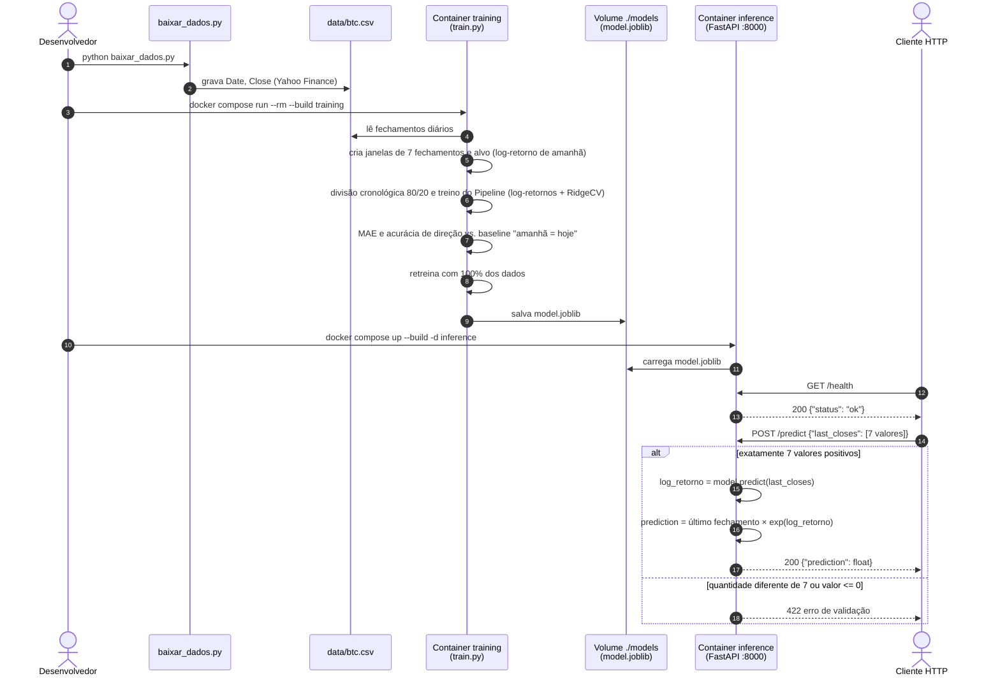
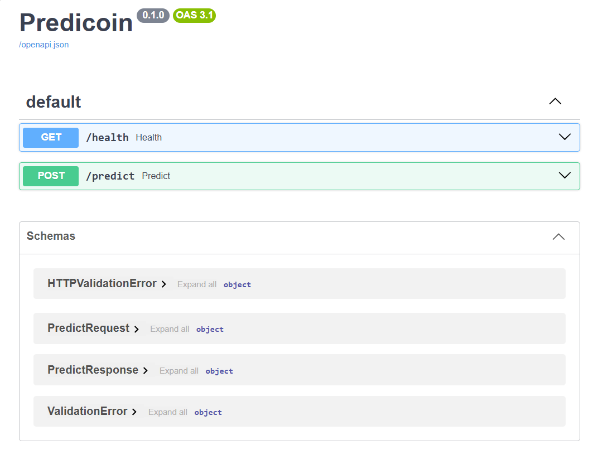
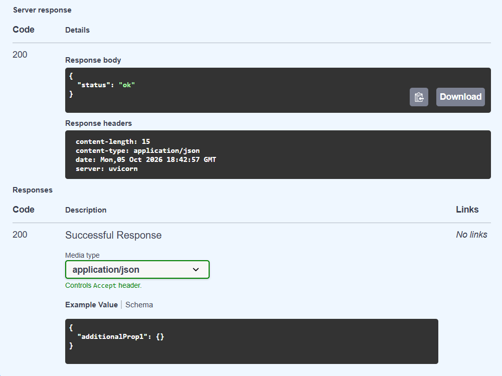
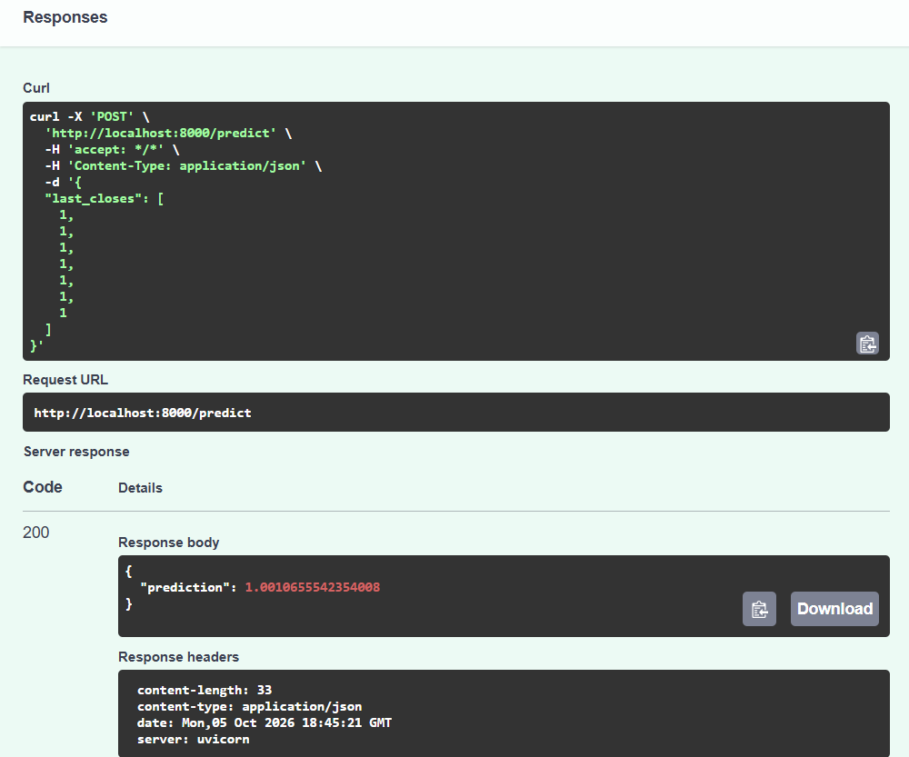

# Predicoin - Devlog

## Uso de IA

- Desenvolvimento de um plano de ação
- Criação do script para baixar dados
- Design do diagrama UML
- Mudanças para melhoria do modelo

## Decisões iniciais

Dados: CSV diário de BTC-USD (Yahoo Finance), últimos 3 anos, com as colunas Date e Close.

Alvo: prever o fechamento do dia seguinte.

Modelo: regressão linear (scikit-learn) usando os últimos 7 fechamentos como entrada. Depois troquei por Ridge sobre log-retornos (ver Melhoria do modelo).

Divisão treino/teste: cronológica, 80% para treino e 20% para teste.

Artefato: model.joblib.

Backend: FastAPI com duas rotas, GET /health e POST /predict.

Como o modelo chega à inferência: por um volume compartilhado ./models entre os dois containers, montado pelo docker-compose.

## Melhoria do modelo

A primeira versão (LinearRegression sobre os 7 preços) empatou com o baseline "amanhã = hoje". Usando o preço direto como entrada, a regressão acaba aprendendo a repetir o último fechamento. Para tentar melhorar fiz três mudanças, sem mexer na API:

1. Passei a prever o log-retorno do dia seguinte, log(fechamento de amanhã / fechamento de hoje), usando os 6 log-retornos que saem dos 7 fechamentos. O preço foi de uns 27 mil para mais de 100 mil USD no período, e os retornos ficam numa escala bem mais estável. A API converte de volta para preço multiplicando o último fechamento por exp(log-retorno previsto).
2. Troquei a regressão linear por RidgeCV, com o alpha escolhido por TimeSeriesSplit(5) e os dados padronizados. A conversão de preço para retorno ficou dentro de um Pipeline salvo no model.joblib, assim a API não precisa repetir essa conta.
3. A divisão 80/20 agora serve só para medir o erro. Depois disso o modelo é treinado de novo com todos os dados antes de ser salvo, para usar também os dias mais recentes.

Também adicionei a acurácia de direção (se o modelo acertou se o preço subiu ou caiu).

Resultado no conjunto de teste (218 dias), com o mesmo CSV:

| Modelo | MAE (USD) | Acurácia de direção |
|---|---|---|
| Baseline "amanhã = hoje" | 1.055,92 | - |
| LinearRegression sobre preços (v1) | 1.058,76 | 52,8% |
| Ridge sobre log-retornos (v2) | 1.055,82 | 50,0% |

A v2 deixou de ficar atrás do baseline, mas a diferença é de só 0,10 USD, então na prática empatou. O RidgeCV escolheu um alpha bem alto (3162), o que deixa os coeficientes quase em zero. Ou seja, os retornos passados quase não ajudam a prever o de amanhã, e o modelo acaba prevendo o último fechamento com uma pequena tendência de alta. Os 50% de acurácia de direção mostram a mesma coisa. Para o BTC no horizonte de um dia isso já era esperado, e para melhorar de verdade seria preciso usar outras informações além do preço.

## Diagrama UML

Diagrama de sequência do fluxo: o container de treino gera o modelo no volume compartilhado e o container de inferência carrega esse modelo para responder às requisições.



## Organização do repositório

```
Predicoin/
├── baixar_dados.py
├── data/
│   └── btc.csv
├── training/
│   ├── train.py
│   ├── Dockerfile
│   └── requirements.txt
├── inference/
│   ├── app.py
│   ├── Dockerfile
│   └── requirements.txt
├── models/
│   └── model.joblib
├── prints/
├── docker-compose.yml
└── README.md
```

## Como reproduzir

Precisa do Docker Desktop aberto. Os comandos são rodados na pasta Predicoin/.

### 1. Dados

O data/btc.csv do repositório é o que usei para os resultados deste README, então não precisa baixar de novo. Se quiser dados atualizados:

```bash
pip install pandas requests yfinance
python baixar_dados.py
```

O script pega os últimos 3 anos a partir do dia em que roda, então ele sobrescreve o CSV e os MAEs podem mudar um pouco.

### 2. Treino

```bash
docker compose run --rm --build training
```

Mostra o MAE e a acurácia de direção dos modelos e do baseline, e salva o models/model.joblib. Saída que obtive com o CSV do repositório:

```
Amostras: 1090 (treino=872, teste=218)
MAE baseline (amanhã = hoje):     1,055.92 USD
MAE LinearRegression (preços):    1,058.76 USD | direção: 52.8%
MAE Ridge (log-retornos):         1,055.82 USD | direção: 50.0%
Alpha escolhido pelo RidgeCV: 3162.28
Modelo (treinado com todos os 1090 exemplos) salvo em /app/models/model.joblib
```

### 3. Inferência

Tem que rodar o treino antes, porque a API carrega o model.joblib quando sobe.

```bash
docker compose up --build -d inference
```

### 4. Teste

```bash
curl localhost:8000/health
# {"status":"ok"}

curl -X POST localhost:8000/predict -H "Content-Type: application/json" \
  -d '{"last_closes":[62000,62500,61800,63000,63400,62900,64000]}'
# {"prediction":64058.38...}

curl -X POST localhost:8000/predict -H "Content-Type: application/json" \
  -d '{"last_closes":[1,2,3]}'
# HTTP 422
# {"detail":[{"type":"too_short","loc":["body","last_closes"],"msg":"List should have at least 7 items after validation, not 3", ...}]}
```

Os 7 valores vão do mais antigo para o mais recente. Se não vierem exatamente 7 valores, ou se algum for menor ou igual a zero, a API responde 422. Dá para testar também pelo navegador em http://localhost:8000/docs (Swagger). No PowerShell isso é mais fácil, porque lá o curl é um alias de outro comando.

Página do Swagger com as duas rotas:



GET /health respondendo 200 com {"status": "ok"}:



POST /predict com sete fechamentos iguais a 1. Com o preço parado, todos os retornos são zero e o modelo devolve só a tendência média de alta que aprendeu (cerca de 0,107% ao dia), por isso a predição dá 1,00107:



### 5. Encerrar

```bash
docker compose down
```

Depois de retreinar, é preciso rodar esse comando antes de subir a inferência de novo. Se o container antigo ainda estiver rodando, ele continua com o modelo antigo.

## Dificuldades

- Quando tentei validar o treino fora do Docker, o pandas não importou: `ImportError: DLL load failed while importing pandas_datetime: Uma política de Controle de Aplicativo bloqueou este arquivo`. Resolvi rodando o treino e a inferência só pelos containers, que não usam o Python da máquina.
- Depois de retreinar, o `docker compose up --build -d inference` viu que o container já estava rodando e não recriou ele. Como o model.joblib só é lido quando a API sobe, ela continuou usando o modelo antigo. Resolvi rodando `docker compose down` antes de subir de novo (passo 5).
- Baixar o CSV de novo mudou os MAEs. O baixar_dados.py pega os últimos 3 anos a partir do dia em que roda, então o fim da série mudou e os números mudaram um pouco (o MAE do baseline foi de 1.055,83 para 1.055,92 USD). Por isso deixei o CSV do repositório como referência para os resultados.

## Limitações

- O modelo só usa o preço. Volume, notícias, indicadores técnicos e dados macroeconômicos ficaram de fora.
- O modelo não supera o baseline de forma significativa. Mesmo a versão com Ridge empatou com o "amanhã = hoje" (1.055,82 contra 1.055,92 USD) e acertou a direção em 50% das vezes.
- Só prevê um dia à frente. Para prever mais dias seria preciso encadear as predições, e o erro iria acumulando.
- Não tem re-treino automático. O modelo só muda quando o treino é rodado na mão, e a inferência precisa ser reiniciada para carregar o modelo novo.
- Os dados mudam conforme o dia do download, então rodar o baixar_dados.py de novo muda os resultados.
- Se a inferência subir antes do treino, o container fecha com FileNotFoundError, sem uma mensagem mais clara.
- A API não tem autenticação, e a validação só confere se vieram 7 valores positivos, não se são preços que fazem sentido.

## Aviso

As predições deste projeto são experimentais e servem só para demonstrar a integração entre treino, modelo e inferência com Docker. Elas não são recomendação de investimento.
